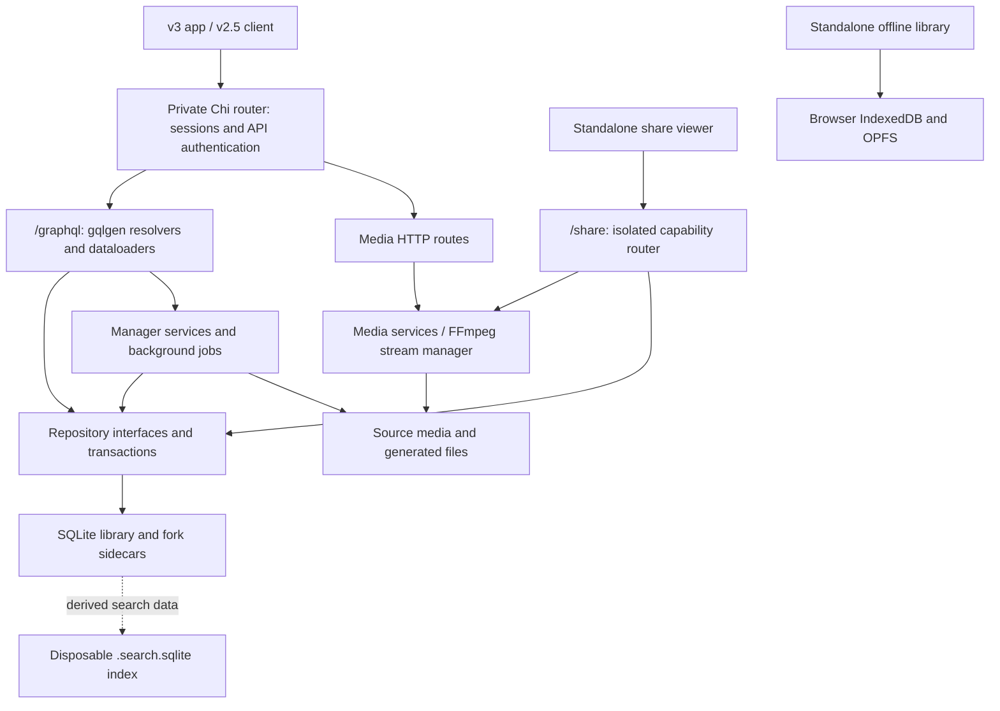

# v3 rewrite architecture

This is the system overview for the `v3-rewrite` tracking fork. Stash runs one
Go backend with a shared GraphQL API, a SQLite library, filesystem media, and
embedded browser applications. Active frontend work belongs in `ui/v3/`;
`ui/v2.5/` remains the read-only fallback and client compatibility baseline.

Start here for runtime and storage boundaries. The [v3 frontend guide](../ui/v3/docs/architecture.md)
maps UI modules and state ownership; the [development guide](../ui/v3/docs/development.md)
owns setup and validation commands. [FORK.md](../FORK.md) is authoritative for
upstream syncs and migration policy. See the [documentation index](README.md)
for feature guides and explicitly labelled future plans.

## Runtime map

[cmd/stash/main.go](../cmd/stash/main.go) initializes configuration, the
singleton [Manager](../internal/manager/init.go), then the
[HTTP server](../internal/api/server.go). The manager assembles repositories,
entity services, sessions, plugin/scraper caches, jobs, and media processing.
Setup and migration-required states leave the HTTP API available so the browser
can complete setup before entering the library.

Production serves embedded assets from [ui/ui.go](../ui/ui.go) and
[ui/ui_v3.go](../ui/ui_v3.go). `--enable-v3-ui` / `STASH_ENABLE_V3_UI=true`
selects v3 at the application mount point and enables supporting HTTP routes,
including v3 segmented streaming, preview images, and shares. It does not add a
`/v3` URL prefix. A configured custom UI directory overrides the embedded UI
selection. The GraphQL schema is shared; the flag is **not** a separate API
version or a switch that disables fork database migrations.

| Browser entry point | Responsibility and boundary |
| --- | --- |
| [main.tsx](../ui/v3/src/main.tsx) → [app.tsx](../ui/v3/src/app.tsx) | Main v3 app: Apollo, system status, configuration/locales, plugin registration, then TanStack Router |
| [offline-main.tsx](../ui/v3/src/pwa/offline-main.tsx) | Standalone offline library/player; boots from bundled assets and local downloads without the main app's server or plugin gates |
| [share-main.tsx](../ui/v3/src/share-main.tsx) | Guest viewer; uses scoped share JSON/media endpoints without owner configuration, plugins, or the owner's Apollo session |
| [ui/v2.5](../ui/v2.5/) | Upstream UI, served when v3 is disabled; its operations continue to work against the same backend when v3 is enabled |

[vite.config.ts](../ui/v3/vite.config.ts) builds the three v3 HTML entries and
their shared chunks. During development, Vite serves the UI on port 3002 and
proxies backend paths; client URL helpers can also address the configured
backend directly. In production, the server inserts the public proxy prefix
into the HTML `<base>` element. [platform-url.ts](../ui/v3/src/core/platform-url.ts)
derives API URLs and router paths from it. Preserve this boundary when adding
links, worker scopes, or media requests.

## Backend responsibilities

| Area | Owns |
| --- | --- |
| [graphql/schema](../graphql/schema/) and [gqlgen.yml](../gqlgen.yml) | Public schema and Go type/resolver generation |
| [internal/api](../internal/api/) | HTTP routes, GraphQL resolvers, input translation, authentication, and response shaping |
| [internal/api/loaders](../internal/api/loaders/) | Request-scoped batching of related entity reads to avoid N+1 queries |
| [internal/manager](../internal/manager/) | Application lifecycle and service wiring; scan/generate/import jobs in `task_*.go`; stream and download coordination |
| [pkg/models](../pkg/models/) | Domain values, filter/query models, and repository interfaces; `Repository` supplies entity stores and a transaction manager |
| [pkg/scene](../pkg/scene/), [pkg/image](../pkg/image/), [pkg/gallery](../pkg/gallery/), [pkg/group](../pkg/group/) | Entity operations that coordinate related records, files, and validation; other entity packages supply their own validation/update helpers |
| [pkg/sqlite](../pkg/sqlite/) and [pkg/txn](../pkg/txn/) | Repository implementation, query builders, connection pools, migrations, transaction context, and commit hooks |
| [pkg/ffmpeg](../pkg/ffmpeg/), [pkg/file](../pkg/file/), [pkg/previewimage](../pkg/previewimage/) | Probing, transcoding/streaming, file scanning, and still-image renditions |
| [pkg/job](../pkg/job/) | In-memory job queue, progress, cancellation, and subscriptions |
| [internal/sharing](../internal/sharing/) | Frozen share membership, credentials, expiry, and revocation |
| [pkg/plugin](../pkg/plugin/), [pkg/scraper](../pkg/scraper/), [internal/identify](../internal/identify/) | Backend extensions, metadata retrieval, and identification |

Resolvers receive their repository and service dependencies from
`api.Initialize`. Ordinary entity operations go through repository interfaces;
resolvers can call a store directly or delegate to an entity service. These
packages are collaborators, not successive stages every request must traverse.

`withReadTxn` / `withTxn` in [resolver.go](../internal/api/resolver.go) delegate
to repository transaction helpers. Use the callback's context for repository
calls so they share that transaction. Transactions are scoped by individual
operations and loaders; a whole GraphQL response is not automatically one
database snapshot. Filesystem and FFmpeg work have separate lifecycles and are
not made atomic by a SQLite transaction.

## Data and compatibility

| Data | Owner and lifetime |
| --- | --- |
| Library metadata and relationships | Main SQLite file, normally `stash-go.sqlite`; authoritative upstream tables plus fork sidecars |
| Server/UI configuration | YAML configuration managed by [internal/manager/config](../internal/manager/config/); includes UI defaults and plugin settings |
| Original media | Configured library paths and archive contents; database file/folder records describe these files |
| Stored artwork blobs | [BlobStore](../pkg/sqlite/blob.go), configured for database blobs or a separate filesystem location |
| Generated media | Configured generated paths: covers, previews, sprites, transcodes, temporary downloads; generation and cleanup belong to manager/media services |
| Search acceleration | Separate `<database>.search.sqlite` plus an in-memory exact-count cache; derived and rebuildable |
| Browser state | Apollo entity cache, URL/filter state, device preferences, and deployment-scoped offline IndexedDB/OPFS; detailed ownership is in the [frontend guide](../ui/v3/docs/architecture.md#state-configuration-and-type-boundaries) |

[database.go](../pkg/sqlite/database.go) uses WAL mode with one write connection
and up to ten read connections. [read_acceleration.go](../pkg/sqlite/read_acceleration.go)
pins read snapshots before accepting cached counts or search candidates. The
FTS5 trigram index narrows candidates; the original SQL predicates still check
them. Missing, stale, unsupported, or overly broad index results fall back to
ordinary SQL. External writes invalidate caches, and startup rebuilds the search
index. No FTS tables or persistent search tracking triggers are added to the
library database. See [read performance](read-performance.md) for details.

### Two migration tracks

Upstream SQL migrations in [pkg/sqlite/migrations](../pkg/sqlite/migrations/)
own `schema_migrations` and `appSchemaVersion`. Fork Go migrations register
through [fork_migrate.go](../pkg/sqlite/fork_migrate.go) and record their version
in `fork_schema_migrations`. Fork changes must not advance the upstream numeric
sequence or add columns to upstream-owned tables.

Fork-only values live in `fork_*` sidecars: canonical saved filters, performer
name policies, extended file metadata, scene-cover provenance, and shares.
Migration 5 consolidated the earlier private schema changes into compatible
sidecars; subsequent migrations add ordinary browsing indexes, cover origins,
and share grants/sessions. Idempotent reconcilers run after migration and when a
current database opens, importing compatible upstream edits and invalidating
derived state. These paths run in the fork binary regardless of the UI flag.

An upstream-only binary at the matching upstream schema version can use the
base representation while ignoring fork sidecars. This does not promise that
any older Stash release can open the database. [Retiring compatibility](v3-schema-promotion.md)
is a conditional future transition, not current migration policy.

### Shared API, richer v3 state

Keep GraphQL additions compatible with existing operation shapes, argument
defaults, and mutation behavior. In particular:

- Saved filters keep their v2.5 `object_filter` projection while a sidecar holds
  the canonical v3 AST and a legacy shadow. Complex conflicting edits preserve
  both values for resolution; they are not silently flattened into a new AST.
- Default filters use the equivalent `defaultFilters` / `forkDefaultFilterState`
  configuration bridge. `configureDefaultFilter` updates one view atomically;
  changing a default must not replace the entire UI configuration.
- `Scene.sceneStreams` keeps the legacy stream catalogue.
  [sceneStreamsV3](../internal/api/resolver_model_scene_v3.go) supplies v3's
  separate catalogue. The [legacy adapter](../internal/manager/scene_stream_legacy_compat.go)
  preserves v2.5 behavior even with v3 enabled.
- Legacy bulk mutations retain their synchronous return contract; additive
  `bulk*UpdateJob` mutations support v3's background workflow.

[FORK.md](../FORK.md) documents the storage bridges and fork-owned extension
files. [check-compatibility.mjs](../ui/v3/scripts/check-compatibility.mjs) checks
the schema, mainline operations, and upstream migration track against a pinned
baseline. It cannot prove every runtime behavior of an external client.

## Request and work flows

### Browsing a library

The main UI's generated typed documents go through the shared Apollo client to
`/graphql`. gqlgen dispatches to resolvers such as
[FindScenes](../internal/api/resolver_query_find_scene.go); repository queries
run inside read transactions, and model field resolvers/loaders hydrate requested
relationships. The selected GraphQL fields determine which count, page, or
aggregate work is needed.

v3 scene/image lists request cards and exact counts separately. Cards can render
while the total is unknown; count-dependent pagination and bulk actions wait
for the total. Apollo merges the selections, and mutation invalidation refreshes
the affected queries. Other entities can use combined item/count queries.
[The list contract](../ui/v3/docs/architecture.md#lists) owns this distinction.

### Editing and background jobs

A normal edit validates inputs, writes through the appropriate service/store
in a transaction, and returns data for Apollo normalization. Relationship,
membership, and count changes use targeted query invalidation; scalar changes
can propagate through the normalized entity without a full list refetch.

Long-running work goes through `pkg/job.Manager`. `Add` queues jobs for serial
execution; `Start` explicitly starts a concurrent job. Individual jobs may also
parallelize their own tasks. The queue is in memory and does not survive a
server restart. Scan entry points live in
[manager_tasks.go](../internal/manager/manager_tasks.go), with walking and
per-file processing in [task_scan.go](../internal/manager/task_scan.go).
Probing, hashing, and generation depend on scan options; a scan does not
unconditionally generate every derivative.

For v3 bulk edits, [bulk resolvers](../internal/api/resolver_mutation_bulk_scene.go)
resolve the affected IDs, removing pagination from a filter selection, then
enqueue the operation. [task_bulk_update.go](../internal/manager/task_bulk_update.go)
commits each item independently and runs enabled post-hooks after successful
writes. Failed items roll back and are reported; cancellation or an error does
not undo already committed items.

[Job subscriptions](../internal/api/resolver_subscription_job.go) retain the
legacy combined stream and add separate lifecycle/progress streams. The API
forwarder preserves received lifecycle events and may drop progress under
backpressure. Upstream job-manager buffers and disconnected clients can still
miss events, so subscriptions are not a durable event log.
[core/job-queue.ts](../ui/v3/src/core/job-queue.ts) reconciles visible tasks with
HTTP snapshots; [monitor-job.ts](../ui/v3/src/core/monitor-job.ts) watches
completion independently of an edit sheet remaining mounted.

### Playback and downloads

GraphQL supplies scene metadata and stream descriptors; media bytes use HTTP
routes under `/scene/`, `/image/`, and related namespaces. Scene routes delegate
to manager/media services and the FFmpeg stream manager for direct files,
remuxing, or transcoding. v3 adds fMP4 HLS endpoint families and scoped transcode
sessions while retaining legacy endpoints.

The UI's shared `ScenePlayer` separates source selection, pure seek/transition
policy, and browser effects. Scene detail, lightboxes, and TV reuse it; offline
playback adapts stored metadata to a local `blob:` source. Keep the player/store
and native video stable through source changes. Session leases control encoder
lifetime separately from URL reloads. The [player guide](../ui/v3/docs/player.md)
maps both sides of this contract, including clip timelines and recovery.
[Preview images](preview-images.md) and [offline downloads](../ui/v3/docs/offline.md)
cover their distinct generation and storage paths.

## Extension and trust boundaries

Backend plugins in [pkg/plugin](../pkg/plugin/) support external raw/RPC tasks
and embedded JavaScript through Goja, plus configured hooks. Scrapers in
[pkg/scraper](../pkg/scraper/) use YAML definitions and XPath, JSON, GraphQL, or
scripts to retrieve metadata. Identification coordinates these sources and
stash-box matching.

v3 UI plugins are a separate browser extension surface. The
[plugin host](../ui/v3/docs/plugin-host.md) stages timed registrations before
building the router and exposes shared Apollo, navigation, UI, and locale
capabilities. Failed registrations cannot block core routing. Plugins and
custom JavaScript run as trusted application code, not in a security sandbox;
runtime CSS/JavaScript customization is covered by [theming](../ui/v3/docs/theming.md).

Shares use [routes_share.go](../internal/api/routes_share.go), an isolated
`/share` router selected before owner authentication. A link secret is exchanged
for a path-scoped guest session. Each request is checked against the current
grant and frozen media membership. Guest credentials do not authorize GraphQL
or the ordinary library routes, and the guest entry point does not boot the
owner app. [Sharing](sharing.md) owns the public-host proxy configuration,
credential lifecycle, rendition policy, and limits.

The [service worker](../ui/v3/src/pwa/service-worker.ts) precaches the standalone
offline entry and its dependency graph. Selected application navigations fall
back to it on network failure, timeout, or server 5xx; authentication responses
remain unchanged. API responses and streamed media are not a general-purpose
worker cache. Saved video bytes belong to OPFS, with metadata and queue state in
IndexedDB, scoped by backend mount URL. This is a device copy, not a synchronized
replica of the server library.

## Making a change

| Change | Start with |
| --- | --- |
| Add or extend a GraphQL field | Schema → gqlgen mapping/resolver → repository/service if needed → v3 operation; preserve the v2.5 contract |
| Add persisted fork data | [FORK.md](../FORK.md), a sidecar migration/reconciler, and close/upstream-write/reopen compatibility fixtures |
| Add a list or detail view | [Frontend module map](../ui/v3/docs/architecture.md#module-map), typed list configuration, and shared detail layouts |
| Change playback | [Player guide](../ui/v3/docs/player.md), frontend transition tests, and backend stream/timestamp tests |
| Change navigation, gestures, or overlays | [Interaction guide](../ui/v3/docs/interactions.md) and browser regression fixtures |
| Change guest or offline behavior | [Sharing](sharing.md) or [offline](../ui/v3/docs/offline.md); preserve their independent startup/data boundaries |

Regenerate bindings instead of editing generated files. `make generate` updates
Go and v2.5 GraphQL output; v3 generation is separate and included in its
dev/build/check scripts. TanStack generates the route tree during Vite dev/build.
Build both embedded UIs before full Go validation. The
[development guide](../ui/v3/docs/development.md#validation) gives the validation
sequence and browser/device limits; [deployment](v3-deployment.md) covers
publication. Update the owning current guide when a documented contract changes.
