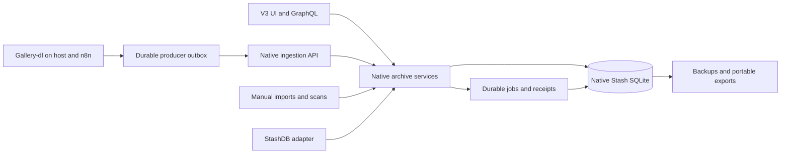

# Native archive and independent fork transition plan

Status: implementation in progress on `v3-rewrite`, following the plan requested
on 2026-09-30. The [progress record](native-archive-progress.md) distinguishes
validated checkpoints from outstanding work. Production remains on the frozen
compatible release until the release and data migration described here are
complete.

The target is one independently maintained Stash application that owns media,
performers, source accounts, posts, provenance, import rules, and metadata edits.
Gallery-dl supplies observations and completed files through a supported API.
StashDB and other stash-box integrations remain supported. Existing catalog data
is imported into the native model, with an audited mapping for every source
record and preservation of existing UUIDs, links, merges, and manual choices.

This is the full transition plan. It supersedes the narrower planning scope of
[Retiring v2.5 compatibility](v3-schema-promotion.md), whose migration invariants
remain useful. [FORK.md](../FORK.md) describes the currently implemented bridge;
the first implementation phase updates that policy for independent development.

## Decisions and boundaries

- End routine rebasing and the obligation to keep the database writable by
  upstream Stash. Maintain an upstream reference and deliberately port useful
  fixes, especially security, platform, and media-processing fixes.
- Make v3 the sole application UI. Own the backend API and schema versions.
  Retain the independent v3 plugin contract and stash-box protocol integration.
- Keep SQLite and the current scene, image, performer, and file abstractions.
  Add normalized source and provenance tables. This project does not require a
  PostgreSQL migration or a second authoritative media library.
- Give performers, scenes, images, galleries, and file records portable UUIDs while keeping
  existing integer IDs for internal relationships and current library links.
  Existing catalog performer UUIDs take precedence over newly generated UUIDs.
- Keep account ownership separate from depicted performers. Accounts and posts
  can exist with no performer. A scrape target can be an aggregator, subreddit,
  search, collection, or personal account.
- Keep media in its existing directories for this transition. Root mappings
  translate host and container paths. Moving files is a separate operation with
  its own archive, backup, and recovery implications.
- Store authoritative catalog data in the native library database. Local
  producer outboxes and gallery-dl download archives retain operational roles;
  neither becomes a parallel editable catalog.
- Preserve the current retention policy during migration. Do not revive deleted
  content, restart intentionally abandoned original downloads, regenerate NFOs,
  or perform online identity resolution as a side effect of import.
- Preserve standalone access through a documented export format and offline
  inspection/import tools. A second browser application is outside this change.

## Current implementation inventory

The following inventory comes from the checked-out Stash, scrape-catalog, and
Catalog Metadata code and the local configuration inspected for this plan.
Exact row counts, database sizes, running jobs, workflow versions, and image
digests must be captured again for rehearsal and production cutover.

| Surface | Current implementation | Transition responsibility |
| --- | --- | --- |
| Application | Go backend, shared GraphQL schema, SQLite, v3 UI plus embedded v2.5 | Own schema/API lifecycle and build only v3 |
| Schema bridge | Primary schema 86 and separate fork migrations through 9 in this checkout | Promote all durable fork data and establish independent lineage |
| Media | Scene/image records, separate files and fingerprints, primary-file associations, many performers | Reuse records and IDs; add UUIDs and provenance |
| Catalog registry | /tank/media/scrape_metadata/registry.sqlite3 | Import source routing, identities, associations, identifier evidence, and redirects |
| Source catalogs | /tank/media/scrape_metadata/catalogs/*.sqlite3 | Import retained source and media evidence into native tables |
| Automation | automation.sqlite3 and run-journal.sqlite3 under the catalog root | Preserve queued work, receipts, checkpoints, deferrals, and completion semantics |
| Producer implementation | /home/andrew/src/private/scrape-catalog | Separate transport/download helpers from catalog storage; transition to API producer |
| Stash integration | CommunityScripts/plugins/catalogMetadata | Migrate its rules and native features; retire its catalog reader/writer hooks |
| Shared gallery-dl config | /home/andrew/.config/gallery-dl/config.json | Replace catalog-writing postprocessors with native ingestion adapter |
| n8n override | /home/andrew/services/n8n/data/workflowConfigs/n8n-gdl-overrides.json | Set container paths, endpoint, producer identity, and credential reference |
| Download archives | Host ~/.archives, mounted into n8n | Preserve archive IDs and skip behavior |
| Media roots | Host /tank/media/porn; Stash/n8n /media/porn | Register one logical root with deployment-specific mounts |
| Backup | s3_log_backup.py, catalog SQLite snapshots, media manifests, Stash backup | Publish a native archive snapshot associated with the media manifest |
| Deployment | Stash image followed by stash-s6 image and rootless Quadlet | Pin both revisions/digests and prevent unintended schema upgrades |

Relevant implementation references are [models](../pkg/models),
[fork migrations](../pkg/sqlite/migrations), [plugin events](plugin-events.md),
[plugin settings](plugin-settings.md), [deployment](v3-deployment.md), and
[file deletion recovery](file-deletion.md). The current catalog library lives
outside this repository; preserve its schema fixtures and tests when introducing
the native importer rather than relying on its installation remaining available.

## Native data model

### Media and identity

Scene and Image remain the logical media records. Their existing performer,
gallery, group, tag, marker, playback, rating, and organized relationships remain
intact. A generic media API can expose both types without duplicating those
records in another catalog.

Add unique archive UUIDs and durable merge redirects. UUID redirects remain
resolvable after a merge; aliases and external associations transfer in the same
domain operation. File UUIDs identify file records, while content checksums
identify bytes. A checksum must not serve as a performer's or scene's identity.

Add shared content identities for verified identical bytes, retaining existing
file rows as locations and existing scene/image file associations. Different
encodings remain distinct contents and can be associated with one scene/image
when verified. Exact duplicate bytes do not automatically authorize merging two
existing scenes with conflicting edits, markers, or playback history.

Keep the current matching fingerprints needed by stash-box. An additional strong
archive checksum does not replace MD5, oshash, or phash at that boundary.

### Sources and evidence

The table names below are proposed native names. Final migrations must define
foreign keys, uniqueness, indexes, and lifecycle rules before implementation.

| Native concept | Records and relationships |
| --- | --- |
| Source account | source_accounts with a UUID, service, kind, and review state; independent of performers |
| Account identifier | source_account_identifiers with namespace, identifier kind, value, evidence, and observed validity |
| Ownership | account_performer_links and explicit rejected/unlinked decisions; separately versioned from media attribution |
| Profile version | Shared meaningful account profile bodies plus observations referring to them |
| Source collection | source_collections for scrape targets, feeds, subreddits, searches, and manual batches |
| Source post | source_posts keyed by service namespace and upstream ID; explicitly qualified legacy keys when upstream ID is unknown |
| Post revision | Shared normalized post body, semantic content digest, date basis, language, and normalizer version |
| Capture | Who observed which revision, when, with which extractor, source URL, and small attachment/profile-reference differences |
| Attachment | Ordered post attachment and source media ID; references zero or more observed file variants |
| Media appearance | Attachment-to-scene/image association, content identity, and provenance; many posts may reference one item |
| Source album | Explicit post-to-gallery association with ordered attachments, download completeness, and preserved membership decisions |
| Translation | Original revision/text identity, translated text, language, provider, and provenance; originals remain intact |
| Retained document | Deduplicated original NFO bytes and parser results, with all original path/post references and selected heads |
| Import policy | Typed source/folder defaults, mappings, title policy, entity-creation policy, and organized behavior |
| Metadata decision | Field-level selection or explicit override with origin, revision, and user/import provenance |
| Ingestion | Producers, runs, event receipts, job state, checkpoints, leases, and durable retry state |
| Migration | Source-record mappings, checkpoints, unresolved items, reconciliation reports, and source snapshot identity |

Use actual foreign keys for scene/image links. If a table supports either type,
use checked nullable foreign keys or a rigorously constrained common identity
table; do not introduce unchecked entity-type/ID pairs for authoritative links.
An observed attachment without a local file remains source evidence. It need
not fabricate a playable scene or image.

Account identifier equivalence must preserve the shared resolver's current
distinctions: native IDs, handles, and mirror identifiers have qualified
namespaces. Coomer/Kemono identifiers include the mirror and underlying service.
Instagram, Reddit, Twitter, Bluesky, TikTok, Patreon, OnlyFans, and Fansly need
explicit fixtures. Unknown gallery-dl extractors can store qualified observations
without speculative identity merging. Observed handle changes remain history;
reused handles or contradictory IDs create review items.

Account ownership does not populate scene/image performers automatically. A
reviewed import policy may assign default performers for a source. Aggregator
and unknown sources default to no inferred performers. Canonical-name and alias
matching considers all candidates; an ambiguous match remains unresolved until
explicitly linked. Existing explicit decisions outrank inferred suggestions.

### Post revisions and storage reduction

Preserve the current shared-body design. One post revision can have many captures
and attachments; a repeated capture does not require another full post body.
Repeated profile bodies are shared across posts in the native archive.

Keep the current reduction rules: retain useful full-size media references or
the best available fallback, label preview fallbacks accurately, and omit known
redundant preview ladders. Preserve useful video/animation manifests and parent
post provenance. Ignore known profile counters, viewer state, and internal flags
when deciding whether a meaningful profile revision occurred. Apply those rules
to serialized copies, preserving gallery-dl's working metadata.

Version normalization policies. Preserve old capture/observation IDs as legacy
identifiers when canonical IDs change. Migration comparison must reconstruct the
retained payload semantics, including capture patches and profile references.
Do not promise recovery of fields the existing reduction policy already removed.

### Source-post albums and galleries

Create a logical Stash gallery when source evidence identifies an album or a
multi-attachment post. Use the canonical post identity, never a caption, account
name, filename prefix, or common download directory, to identify its gallery.
Reddit gallery items and Twitter multi-media posts are initial fixtures; other
extractors use the same ordered attachment contract when they supply evidence.
Keep source-declared albums eligible even if only one attachment has downloaded.
Ordinary single-media posts do not create galleries by default. Unknown counts
or conflicting post membership remain unresolved rather than guessing.

Preserve source attachment order independently of download order and filenames.
Images become gallery images; video attachments link their scenes to that same
gallery. Expose one ordered album view for mixed media. Missing, excluded,
failed, or still-downloading attachments remain visible source states without
fabricating playable entries. Add verified associations as files become
available, using bounded work on the affected post and idempotent transactions.
Track source-manifest completeness separately from local download completeness:
a partial scrape must not remove previously known attachments. Repeated slots
may reference the same media entity without copying its file; gallery membership
and the ordered source attachment list are distinct relationships.

An image or scene may belong to several source albums when it appears in several
posts; share the existing entity where its identity is verified. A repeated
delivery or rescan must not create another gallery or duplicate membership.
Source reordering/revisions keep history and respect explicit ordering choices.
Album title, date, description, URLs and cover selection follow the same
field-decision rules as other metadata. Do not infer depicted performers from
the publisher of an aggregator's album.

Preserve existing folder/ZIP/manual galleries and all their memberships during
import. Automatically created source galleries need durable identities and an
explicit origin, rather than being mistaken for hand-curated galleries because
they have no filesystem path. Adopt an existing gallery only with an exact
recorded association or reviewed choice, never a matching title alone. Manual
additions, removals, covers, and deliberate empty metadata must survive later
scrapes. Explicit unlink or gallery deletion suppresses silent recreation;
removing a gallery association does not delete its files or source evidence.

Backfill album associations from retained catalog post/appearance data when the
evidence is sufficient. Include dry preview, progress/retry, conflict reports,
desktop/mobile navigation, and gallery/attachment relationships in native
backup, standalone export, and restore verification. Purchased/manual batches
may also form galleries without requiring a fictitious source post.

### Direct scans and purchased media

Performers and media do not require scrape provenance. Purchased MP4s and other
files added directly to a Stash scan receive ordinary scene/file identities and
retain the same performer, playback, marker, and metadata features. No source
account, upstream post, or fictional scrape record is required. A performer may
have only directly imported media, only scraped media, or both.

Let the owner assign a performer once to a folder or import batch. Subsequent
new files can inherit that explicit rule; filename title fallback applies only
when a permitted stronger selection is absent. Never replace an intentional
empty title or existing curated attribution. Name/alias matching must return
all candidates and leave ambiguity for review. Do not guess performer identity
from an arbitrary vendor filename or treat a directory name as verified account
ownership.

Manual intake can optionally retain vendor URLs, purchase notes, or collection
membership, without making any of those mandatory. Rescans remain idempotent;
adding a scraped appearance later attaches provenance to the existing media
when the association is verified. The direct-scan path is included in migration,
policy-preview, backup/restore, and standalone export tests.

### Metadata decisions

Native scene/image fields remain the selected values used for browsing. Source
revisions retain alternative captions, dates, and URLs. Metadata decisions record
why a value was selected and whether automatic imports may update it.

Use explicit operations for setting, clearing, and returning a field to inherited
metadata. An empty value chosen by the user is different from a missing value.
Capture, translation, and filename fallback cannot silently replace an explicit
choice. Automatic initialization must remain distinguishable from user edits.

At migration, preserve the current Stash field values as the selected state. Map
known catalog edits and import provenance where evidence exists. Where origin is
unknown, record a preserved legacy value rather than inventing authorship or
allowing the first new scrape to overwrite it. Differences between catalog edits
and Stash values become reviewable alternatives.

Jq remains an optional mapping capability. Target fields come from typed native
schemas and use native field pickers. Preview uses source data, the selected
entity, and relevant edit context, with no internal plugin settings. Source
evidence is immutable; mappings can update permitted curated fields and
relationships, not IDs, fingerprints, ingestion state, or arbitrary source JSON.
Convert existing import/export rules once, report expressions needing review,
and compare preview results before enabling converted policies. Native edits
remove the need for the old catalog-to-Stash export loop. Standalone export
selection can remain configurable independently.

## Promote all compatibility sidecars

Being first class means normal migrations, repositories, constraints, backups,
and API ownership. A normalized one-to-one table is already an appropriate
permanent design when it represents a separate concern. Do not flatten every
table merely to remove its fork prefix.

| Current storage | Native target and conversion |
| --- | --- |
| fork_saved_filter_state | Move the authoritative AST to saved_filters.filter_ast. Resolve pending legacy conflicts and validate every AST before removing object_filter and compatibility shadows. |
| forkDefaultFilterState in config | One authoritative default-filter AST per view in default_filters. Commit the source evidence and converted records together, then publish the cleaned config atomically with a durable checkpoint. Remove dual writes and startup reconciliation. |
| fork_performer_autotag_ignored_names and performer_aliases | performer_names containing name, primary status, order, and auto-tag policy. Preserve the global ignore flag and per-name policy; names remain nonunique across performers. |
| fork_video_file_metadata | video_file_metadata, retaining source validity checks and derived probe fields. |
| fork_image_file_metadata | image_file_metadata, with the same validity rules. |
| fork_scene_cover_sources | scene_cover_sources, preserving selections, original file identity, deleted-source history, and regeneration guards. |
| fork_shares and fork_share_sessions | shares and share_sessions, preserving grant IDs, frozen membership, hashed sessions, expiry, revocation, and existing share links. |
| fork_file_deletions | file_deletions with the same commit/recovery semantics. Drain pending operations before database-path changes or preserve the exact journal association. |
| fork_scenes_created_at and fork_images_created_at indexes | Normal schema-owned indexes; preserve their query plans. Renaming is optional where rebuilding has no benefit. |
| fork_schema_migrations | Import completed history into the independent migration ledger and retain an audit receipt. Remove the parallel runtime migrator after all supported inputs are handled. |
| Disposable .search.sqlite and count caches | Keep rebuildable. They do not need promotion into authoritative storage. Remove assumptions about upstream writers while preserving ordinary cache invalidation and correctness fallbacks. |

The existing narrow promotion outline predates some of these sidecars. Migration
must enumerate actual sqlite_master objects and fail or report unknown fork
objects instead of assuming only the first four exist.

Establish a distinct database lineage and schema-version range. New binaries
validate lineage before writing, and the promoted version must be rejected by
the pinned older binaries. An application marker alone cannot make arbitrary
upstream binaries recognize the fork: use a distinct configured native database
path, explicit deployment ownership, and tested version refusal as well. Future
upstream migration numbers must not accidentally identify a fork schema.

Config and SQLite are separate durability boundaries. Migration records staged
config conversion, database completion, and final config publication so a crash
can resume safely. Never drop the last recoverable filter representation before
the corresponding config conversion is durable. Older supported input schemas
remain one-time migration fixtures, not ongoing compatibility implementations.

## Retire the v2.5 contract completely

Inventory every consumer before removing an endpoint. This includes the v3
application, browser/offline/share entry points, installed plugins, host scripts,
n8n workflows, backup helpers, and any externally configured automation.

The target release removes:

- The embedded v2.5 UI, its dependency installation/build/code generation,
  fallback selection, related distribution archives, and compatibility fixtures
  that exist solely to assert live v2.5 support.
- The v3 opt-in launch flag after updating Quadlets, wrapper scripts, Docker
  images, environment validation, and documentation. The native UI becomes the
  normal application entry point.
- The obligation to preserve legacy GraphQL shapes and mutation semantics.
  Replace flat-filter projections, old configuration writes, deprecated aliases,
  legacy image/stream adapters, and synchronous bulk adapters after migrating
  their actual callers. A deprecated field is audited, not deleted solely
  because it has that annotation.
- Unversioned plugin discovery/adaptation and legacy UI injection support once
  installed packages and repositories are reconciled. Unsupported packages
  receive a clear incompatibility result instead of silent execution.
- Runtime fork reconcilers, upstream database round-trip behavior, and the
  pinned v2.5 GraphQL/build compatibility gate.
- Routine force-pushed rebase releases and architecture constraints whose only
  purpose is minimizing upstream conflicts.

Retain and explicitly test the native v3 plugin settings, UI contributions,
capability negotiation, jq evaluation, and after-success notifications. These
notifications remain unable to veto committed operations. Native catalog
invariants execute in core services; they must not depend on a plugin receiving
an event. Post-commit work that must survive a crash uses a durable outbox.

Replace performer merge's optional legacy behavior with server-generated plans,
revision-checked apply, explicit field conflict decisions, and transactional
transfer of names, source links, UUID redirects, and media associations.

Version the new public contract and regenerate all supported clients together.
Keep one naming convention within each interface. Preserve public media/share
URLs deliberately; they are useful user-facing contracts independent of v2.5.
One-time import adapters may remain available without retaining old live APIs.

Update FORK.md, CLAUDE.md, the v3 contributor guide, build/deployment instructions,
Makefile, CI workflows, schema generation, package manifests, and architecture
documentation together. Keep security and dependency update coverage when
removing the old UI jobs. Upstream imports receive recorded source revisions
and native regression tests.

## Native ingestion API and gallery-dl adapter

### Ownership and transport

Use shared Go domain services beneath the application GraphQL API and a bounded,
versioned HTTP ingestion interface. Proposed routes are /api/v3/ingest/batches,
receipt/status endpoints, and capability discovery. Final names and schemas
are fixed in the API contract phase.

The application API exposes paginated source/account/post/collection queries,
media appearances, provenance/history, and targeted candidate lookup. Mutations
cover explicit link/unlink, guarded merge, import-policy editing, metadata
set/clear/inherit, and review-plan apply. Durable job operations cover submission,
claim/renew, progress, cancellation, retry, and result inspection. Notifications
invalidate the affected UI records after commit. All entry points use the same
validation and transaction services.

Keep gallery-dl and its service credentials in the existing host/n8n worker
environments. Workers claim typed work and return events through the API; moving
job state into Stash does not require bundling every downloader into the Stash
container. Accept supported job kinds and validated arguments, not arbitrary
shell command strings from API callers.

The server is the only writer of authoritative source, identity, and library
tables. Gallery-dl and n8n submit events; they never write Stash SQLite directly.
Provide separate producer credentials scoped to ingestion and permitted roots.
Credentials stay in mounted secrets/environment references, outside catalog
payloads, jq samples, exported source configs, and logs.

An event envelope includes a stable producer ID and event ID, protocol version,
payload digest, run/target identity, event kind, observed timestamp, extractor
version, normalizer version, logical media-root ID, relative path where known,
and sanitized source data. Upstream account, post, and attachment IDs remain
separately qualified identifiers.

Store receipt and domain changes in one transaction. Replaying the same event
returns its existing receipt; reusing its identity with different bytes returns
a conflict. Batch responses identify each committed, rejected, or unresolved
event. Unknown identity is a valid review state; malformed payloads are not
silently acknowledged as successful imports. Expensive hashing, probing,
translation, and thumbnail generation run after commit through durable jobs.

Validate root membership, symlink boundaries, final-file existence and stability,
payload bounds, and supported protocol versions. Root IDs translate paths across
host and containers; paths from an API request are not unrestricted filesystem
authority. Use unique constraints and shared scanner services so ingestion and
a concurrent filesystem scan cannot create duplicate file/entity records.

### Durable capture and file lifecycle

Extend the current Python download helpers into a small supported ingestion
adapter. Preserve their tested filename limits, shared destination locks,
postprocessor ordering, filesystem flushes, archive handling, and retry guards.
Keep source normalization in one maintained implementation per producer/server
contract, with shared fixtures; avoid independently evolving two interpretations.

The server owns canonical identity resolution, semantic revision hashes, and
metadata selection. Producer serialization applies the versioned retention and
credential-redaction policy before writing its outbox. Use common policy fixtures
or generated rule data across Python and Go so preview/profile reduction does
not drift. Queued payloads must not become another permanent copy of metadata
that the retention policy intentionally excludes.

1. Before download, serialize sanitized source evidence to a durable local outbox.
   A failed outbox write prevents the operation from being reported as captured.
2. Submit observations promptly when the API is reachable. A source post may be
   recorded before its file is complete; it is not thereby a playable item.
3. After download and transformations, flush and record the actual final path,
   content identity when available, and a completion event. A GIF-to-MKV or yt-dlp
   filename change must link to the prepared attachment correctly.
4. On an existing-file or archive skip, preserve new post evidence and associate
   the existing asset only with sufficient identity evidence. A skip with no
   resolved filename must not create a fake extensionless file.
5. Remove an outbox event only after a durable server receipt. Keep a distinct
   state for downloaded, queued for ingestion, committed, and failed/reviewable.
   Network failure must not erase metadata or falsely mark a workflow complete.

The outbox uses durable transactions, stable event IDs, bounded batching,
exponential backoff, visible queue depth/age, and explicit capacity behavior.
During an outage, already-running downloads can finish and queue their evidence
while the outbox is healthy. Starting more source work follows the lease rules
below; exhausted storage stops new work with a clear error. No silent metadata
dropping.
At-least-once delivery plus idempotent application is the contract. Do not claim
exactly-once network delivery.

Gallery-dl's download archive remains a download-completion mechanism. Keep its
archive IDs and successful-download semantics. API availability must not make a
completed file download again: delivery is retried from the outbox. Conversely,
an archive row without an acknowledged capture is not proof that ingestion has
completed. Recovery reconciles those states explicitly.

Retain .part files as incomplete downloads, with the current supported-media
policy. Audio-only output does not become a Stash scene. Preserve source evidence
and report unsupported output without making playable-media claims.

### Shared configuration and all launch paths

The shared config currently uses catalog-capture-before-download and
catalog-capture-complete, with prepare and after/skip hooks. Replace their
functions with the new adapter only after integration fixtures pass. Gallery-dl
documents these event hooks and configurable archive behavior; the current
wrapper also relies on implementation-specific behavior that requires pinned
runtime tests. See [gallery-dl configuration](https://gdl-org.github.io/docs/configuration.html).

Update and validate the effective merged configuration for:

- Direct host gallery-dl invocations, including manual/tmux runs.
- update-twitter-media and update-reddit-media, their saved lists, incremental
  date windows, full-history behavior, and strict-error modes.
- Instagram, Bluesky, TikTok, Coomer, Kemono, ThisVid/yt-dlp, and generic extractor
  paths, including Reddit child extractors and retained parent context.
- The shared config mounted into n8n, the n8n override file, n8n_runner.py,
  active workflow nodes, recovery commands, and any host/container copies of
  conversion helpers.
- Metadata-only enrichment and discovery fetchers, which must continue to avoid
  downloading or rewriting media when enriching existing observations.

Keep Coomer and Kemono original=true, current skip/early-stop policies, pacing,
proxy/authentication behavior, conversion settings, and filename safety intact.
The migration must not retry intentionally ignored unavailable originals.
An overridden postprocessor list can omit inherited hooks, so validate the
resolved extractor configuration rather than just the top-level JSON text.

Replace the old catalog preflight with checks for the correct adapter version,
root/mount readiness, writable outbox, credential configuration, and compatible
server capabilities when reachable. Stash being temporarily offline can enter
the documented queued mode; missing mounts or a broken outbox cannot.

Inspect n8n's active workflow graph and references before updating it. Preserve
workflow IDs, credentials, input/output contracts, and result receipt behavior.
Archived older workflows are disabled or marked incompatible with the new
generation so reactivation cannot silently restore direct catalog writes.

## Native import and review interface

Add first-class source/account/collection pages and an import-review queue. The
same routes appear in the desktop sidebar and mobile drawer. Use the existing
Base UI/shadcn wrappers, list/filter infrastructure, typed forms, accessibility,
and localization conventions.

Performer pages show verified source accounts and identity history. Scene/image
pages show source appearances, selected metadata provenance, and alternatives.
Review actions distinguish linked, unlinked, suggested, conflicting, and unknown
states. Already-linked accounts offer inspect/change/unlink actions rather than
another generic link prompt. Linking uses indexed targeted lookups and refreshes
affected entities; no full-library scan runs for a single association.

Show compact post/media summaries by default. Expand revisions, individual
captures, and reconstructed payloads on demand, using native expandable sections.
Expose edit-field context only where it helps explain a mapping operation; do
not repeat the full entity and settings throughout ordinary review screens.

Provide preview/plan and guarded apply for account links, performer merges,
metadata changes, and duplicate resolution. Plans carry entity revisions and
become stale when relevant associations change. Name collisions and ownership
conflicts cannot be resolved by list ordering or approximate-name preference.

For external media, allow choosing a performer once for a folder or batch. Store
the association by UUID, automatically read filenames, and use a filename title
only when no selected source/user title exists. Existing folder/name patterns
can suggest assignments, with ambiguous results held for review. An explicit
clear remains clear. Bare files require no synthetic source post or account.

Make organized policy explicit and independent of provenance. Existing organized
values survive. Migrate current rules and show their actual behavior; a creation
request can already supply organized=true. Prefer clear controls for automatic
metadata application, preservation of user choices, and optional completeness
marking instead of treating organized as an identity or dedupe signal.

The Catalog Metadata plugin's settings and review functions move into these
native features. Preserve dry previews, schema-driven mapping targets, the
filename fallback, canonical/alias matching, and current explicit associations.
Retire its import/export loop only after native parity is verified. The generic
v3 plugin API remains available for unrelated extensions.

## Existing catalog migration coverage

Every imported record receives an explicit outcome: copied, mapped to an existing
native record, deduplicated with preserved references, or retained for review.
No source database or unknown table is silently skipped. Physical row counts can
decrease through normalization; semantic references and retained evidence must
still reconcile.

| Existing data | Native destination and required preservation |
| --- | --- |
| registry catalogs, routes, links, redirects | Source collections/roots, legacy identifiers, catalog grouping history, and validated routing |
| catalog_info | Original catalog identity, schema/version metadata, and import provenance |
| performer_identities | Preserve UUID and profile; attach to its existing Stash performer where bound |
| performer_identity_bindings | Preserve namespace/local ID mappings and old-to-survivor redirects |
| performer_account_associations | Verified ownership decisions, including null entries that deliberately prohibit automatic relinking |
| performer_identity_events, performer_identity_migrations | Identity/merge audit and migration provenance |
| account_identifiers, account_identifier_checkpoints | Namespaced ID/handle evidence, confidence/basis, timestamps, and reconciliation progress |
| accounts, handles, account_profile_urls | Native accounts, historical identifiers, profile URL evidence |
| posts, post_urls, post_aliases | Source post identity, all retained URLs, and aliases without fabricating stronger provenance |
| observations, observation_details | Shared revisions and captures with original IDs, times, extractor versions, date basis, payload patches, and profile references |
| account_snapshots | Deduplicated meaningful profile bodies with all references |
| assets, files, appearances | Content/location/media associations, attachment order, pending/missing/deduplicated states, and surviving-path references |
| memberships | Collection membership independent of ownership/depicted performers |
| translations | Originals, translations, language/provider/provenance, and input identity |
| sidecar_documents, sidecar_sources, sidecar_heads, older sidecars table/view | Exact original bytes, hashes, parser results/warnings, paths, selected versions, and folder defaults |
| metadata_edits | Append-only field choices, timestamps, original path scope, and selected/inherited precedence |
| dedupe_events and file_events | Existing relationship and filesystem history; do not execute historical actions again |
| metadata_prune_queue | Pending cleanup intent, disabled until migrated references and retention checks validate |
| maintenance, translation_jobs, translation_targets | Inventory/maintenance cursors, cached results, priorities, target receipts, retry delays, and pending work |
| enrichment_jobs, enrichment_cooldowns | Staged evidence, pending work, and unavailable-source state |
| enrichment_seed_progress, enrichment_source_progress, enrichment_receipts | Resume position and completion evidence |
| discovery_accounts, discovery_targets, discovery_candidates | Confirmed relationships, unresolved candidates, fetch progress, and review decisions |
| run journal scan_jobs, extractor_jobs, scan_deferrals | Requested scopes/date windows, durable cursor state, retries, and deferrals; reset stale process ownership |
| backfill_completion, backfill_scan_completion, legacy_backfill_skip | Completed components, receipts, and deliberate no-repeat decisions |
| collection_backfill_completion, backfill_policy_migrations | Collection-level completion evidence and recorded policy transitions; preserve their skip/resume semantics |
| catalog_metadata_accounts, catalog_metadata_performers | Older plugin bindings and profile evidence, reconciled with identity-registry migration receipts rather than applied twice |
| legacy_handoffs and n8n result receipts | Outstanding handoff/result semantics, with resolved historical runtime state classified explicitly |
| gallery-dl archive databases | Keep as producer download state; snapshot and associate with the migration, without converting archive rows into fake posts |
| Plugin settings and local filename/folder rules | Native import policy, mapped expressions, completeness settings, and preserved legacy rule provenance |

### Matching imported records to existing Stash data

Use this order: explicit saved bindings; normalized root plus exact relative
path; verified content identity with compatible media type; otherwise review.
Never match by title alone, assume a path-derived asset ID is a checksum, or
choose arbitrarily between multiple candidates. Zip members include archive and
member identity. Mount-prefix differences are translated through registered
roots before matching.

Preserve every existing Stash entity ID and its selected metadata. Bind existing
catalog UUIDs to those entities. Existing catalog performer identities that are
not bound must still be imported as identities with a visible unresolved/native
performer outcome; do not discard them or manufacture a source account owner.
Contradictory bindings block affected identity activation until reviewed.

Keep merged UUID redirects and historical names, including the existing
imelizabethtran merge. Validate that all preexisting account decisions resolve
to the same surviving person after import. An old merged local ID must not
recreate the deleted performer.

Treat present unindexed files through the normal scene/image import service.
Missing or unresolved catalog files retain evidence and migration mappings
without inventing available media. Do not mark a mounted-out root as mass
deletion. A moved file with ambiguous content matches remains reviewable.

Different exact-path overrides on duplicate content are preserved separately
until their scope can be resolved. Do not collapse them by newest timestamp
when that would erase an explicit choice. Unknown legacy fields stay in retained
documents/extension data even if they have no native editable field.

### Import mechanism and verification

Build a resumable importer that reads supported old schema versions through
versioned readers and writes through native domain/import services. Use bounded
transactions, per-source checkpoints, deterministic legacy-to-native mappings,
and a snapshot manifest. A retry must create no extra entities, captures, edits,
or relationship events. Secrets never enter migration reports.

First run a read-only assessment for database versions, integrity, unresolved
filter conflicts, UUID/binding collisions, missing roots, pending deletion
journals, storage requirements, and unknown tables. Capture counts by record
family, graph-reference counts, representative reconstructed payload hashes,
and before/after selected metadata for affected Stash entities.

Rehearse against consistent copies of the actual library, config, and catalogs.
Do not point rehearsal workers at production media for mutation or enable
scrapers/notifications against real endpoints. Measure duration, peak temporary
space, WAL growth, backup size, and query latency. Feed migration failures back
into the importer before scheduling production cutover.

For the first production migration, prefer a measured maintenance window with
legacy writers stopped and fenced. Prestage immutable source snapshots where
useful. If a staged import is refreshed, compare complete changed source tables
and account for deletions and redirects; captured_at alone is not a safe delta
cursor. Take the final Stash snapshot after edits are quiesced so a stale rehearsal
database can never replace recent application changes.

Record a complete semantic reconciliation report. Unresolved candidates may
remain in native review if their evidence is preserved and they cannot cause
incorrect attribution. Missing records, lost explicit choices, broken references,
or identity contradictions are release blockers. Keep old catalogs read-only
through the rollback period and until restore verification succeeds.

## Scheduling and operational services

Native durable job state must exist before retiring the current SQLite journals.
The in-memory application job queue alone is not a substitute for restart-safe
scrape, translation, enrichment, and delivery work.

Use run keys derived from target and effective scan policy, durable leases with
ownership checks, shared destination locks, and bounded pending work. A scheduled
repeat of an already-running equivalent scan is skipped or coalesced; a wider
window is merged deliberately without stacking whole extra scans. Host, n8n,
manual, and recovery launch paths share this policy. Preserve source pacing and
the preference for new captures over historical enrichment/translation.

New source runs require a valid coordinator lease. If the server is unavailable,
scheduled requests coalesce locally and wait; they do not each start an offline
scrape. A running worker can finish its current file after lease expiry but must
pause before requesting more source work until ownership is renewed. Shared
filesystem locks still protect host/container destinations. Recovery checks
fencing tokens before handing a target to another worker. Reordered completion
events may preserve evidence but cannot revive a deleted/replaced file generation
or move a newer run back into an earlier state.

| Current service or integration | Target |
| --- | --- |
| gallery-dl-twitter/reddit/reddit-last-week/instagram services and timers | Keep launch schedules initially; use native run registration, fencing, and the API adapter |
| scrape-catalog-recovery | Native scrape-job recovery plus producer outbox delivery; preserve incomplete work |
| scrape-catalog-enrichment | Native enrichment queue with gallery-dl metadata-only worker adapter |
| scrape-catalog-translations | Native translation queue, cached results, separate original/translated values |
| scrape-catalog-inventory | Native reconciliation with mount guards and explicit pending/missing states |
| scrape-catalog-legacy-catchup | Import completion receipt; retire after proving no old handoff remains |
| stash-recents-scan-autotag | Replace redundant work with targeted ingestion/scan jobs and native import policy; retain scanning for files added outside the adapter |
| dedupe-scraped-content and pre-backup dedupe | Use native plan/apply and provenance preservation with existing backup/download locks |
| s3-backup and s3-backup-recovery | Snapshot native archive state and delivery/run state; publish matching media manifest |
| rclone home-directory backup | Include new configuration and producer state; remove obsolete catalog exclusions only after inventory |
| n8n workflows and container helpers | Submit/inspect native runs and distinguish queued work from successful completed backfills |

Migrate jobs with valid state and idempotency keys; never carry an old PID or lease
forward as proof of a running worker. Preserve permanent completion and deferral
records so the migration does not restart all historical scrapes. Actual active
work must checkpoint/finish or be explicitly handed over before its old worker
is stopped. New code/config is loaded by new processes, so verify no old Python
workers remain after changing writers.

## Backups retention and standalone access

Expand the native backup format to include the library database, config/import
rules, non-rebuildable artwork/blobs, identities and source evidence, pending
ingestion/job state, and any unresolved filesystem recovery journal. Coordinate
producer outbox and download-archive snapshots with a documented acknowledged
event boundary. A database snapshot alone cannot include an event still stored
only on a producer.

Use SQLite-aware snapshots, not copies of active database/WAL files. The
[SQLite Online Backup API](https://www.sqlite.org/backup.html) provides a
consistent individual database copy; coordinating files, config, media manifests,
and multiple producers remains our application's responsibility.

Update s3_log_backup.py and restore/audit helpers to publish a native archive
manifest referencing the database/config/blob objects and media backup manifest.
Keep metadata in S3 Standard under the existing storage policy. Advance the
current/latest manifest only when every required object and receipt boundary
has been verified. Failed metadata backup must not publish a new successful media
manifest or trigger obsolete-object marking.

Measure the cost of replacing many small source databases with a larger native
snapshot. Compress/deduplicate retained payloads and monitor backup duration and
temporary space. Do not silently weaken backup cadence or move metadata to cold
storage to hide a regression. Search caches and regenerated thumbnails remain
rebuildable; original artwork and retained source documents are not caches.

Preserve current pruning semantics, including last-copy and pending-download
checks, identity retention, shared translation/profile references, and explicit
missing-mount guards. Disable pruning during migration. Deleting a scene,
removing a file location, deleting actual bytes, and forgetting source metadata
remain distinct operations. Receipt/identity tombstones must prevent retries
from resurrecting deliberately removed records; prune idempotency state only
with a documented replay horizon or producer checkpoint protocol.

Provide a versioned portable export with UUIDs, redirects, external IDs, sources,
posts, captures, field decisions, relative paths, checksum algorithms/values,
and schema/normalization versions. Binary documents are exported losslessly in a
documented representation. Ship offline list/inspect/verify/import commands and
validate export/reimport without the old plugin or per-source databases. Media
plus this export remains usable independently of a running Stash server.

Restore drills cover an empty installation, a renamed media root, a retained
merged performer, a source post with many attachments, queued undelivered events,
and an interrupted filesystem operation. Restoring a snapshot uses matching
journal and producer state, never an arbitrary mixture of old and new files.

## StashDB and retained external contracts

Keep the existing stash-box integration as an explicitly maintained adapter:
endpoints, authentication, rate limits, fingerprint lookup/submission, performer
and studio metadata, remote merge/deletion handling, and optional draft submission.
Our UUID maps to a tuple of provider endpoint, entity kind, and remote ID. Multiple
providers can describe the same local entity without replacing its identity.

Import stash-box results as attributed metadata choices with existing selection
controls. Preserve matching fingerprints through file/scene migrations. Add
protocol fixture tests and a read-only configured-endpoint smoke test where
credentials are available. Live submissions are not needed for validation.
The [stash-box API](https://github.com/stashapp/stash-box) is a separate supported
boundary from the retired upstream Stash database and UI contracts.

## Implementation sequence and release gates

These are dependency-ordered work packages. They may require several commits
each; none should be described as a cosmetic rename or a single quick migration.
Do not estimate production downtime until a full-copy rehearsal has been measured.

| Phase | Work | Required exit evidence |
| --- | --- | --- |
| 0 Baseline and contract | Record the final bridge revision and deployed artifacts; inventory all clients, schemas, jobs, configs, and backups; update fork policy and freeze target contracts | Complete inventory, accepted invariants, source fixtures, restorable baseline |
| 1 Native schema and services | Promote sidecars, add UUIDs/source/provenance/job tables, implement merge and field-decision services | Migration tests, old-binary refusal, foreign-key checks, restart recovery |
| 2 Ingestion and producer adapter | Implement receipts, root validation, outboxes, run coordination, and shared gallery-dl adapter | Replay, offline, partial-download, archive-skip, conversion, and host/n8n fixtures pass |
| 3 Catalog importer | Import all record families, policies, aliases, and operational state; map existing Stash entities | Full-copy rehearsal with semantic reconciliation, repeatability, and measured resources |
| 4 Native UI and client conversion | Sources/accounts/review, source appearances, metadata policies/previews, manual intake, native plugin boundaries, host/n8n clients | Desktop/mobile workflows and read-only stash-box checks; no required feature depends on catalogMetadata |
| 5 Compatibility removal and packaging | Remove old UI/API/runtime reconcilers, migrate actual callers, consolidate build/CI, pin deployment artifacts | V3-only build and retained-contract tests pass; obsolete runtime paths rejected |
| 6 Backup and cutover rehearsal | Native snapshots/exports, producer boundaries, rollback tooling, service/config inventory, restore drill | Exact runbook passes on copies, backup/restore verified, residual dependency audit clean |
| 7 Production cutover | Quiesce writers, final snapshots, native migration/import, validation, config switch, controlled worker restart | Matching counts/identities/selected fields, healthy API/UI, source ingestion and backup receipts |
| 8 Retirement | Observe scheduled cycles, verify rollback/export coverage, archive old state and remove production mounts/services/package dependencies | No live per-source catalog writers/readers, no v2.5 runtime/build dependency, final acceptance report |

Phases 1–6 are developed and rehearsed before the production schema cutover.
Temporary migration adapters have an explicit removal phase. There is no
permanent dual-write mode between old catalogs and the native database.

## Required verification

| Area | Cases that must pass |
| --- | --- |
| Schema promotion | Supported upstream input, current bridge, historical fork inputs, pending AST conflicts, all sidecars, crash between DB/config publication, rejected newer/foreign lineage |
| Catalog import | Multiple schema versions, rerun after interruption, old path-derived assets, shared post/profile/NFO bodies, unknown legacy fields, exact-path override conflicts, missing/pending/deduplicated files |
| Identity | Existing UUIDs and imelizabethtran merge, explicit unlink, canonical/alias ambiguity, native handle/ID equivalence, reused handles, mirror/native distinctions, concurrent link/merge plans |
| Aggregators | Account linked as publisher without being assigned as performer; mixed known/unknown/multiple performers; source-default policy exceptions |
| Media association | Reddit/Twitter multi-attachment posts, cross-posts, same content across services, differing encodings, existing duplicate Stash entities, zip members, renamed paths and mount prefixes |
| Source albums | One gallery per evidenced album post, source order, mixed images/videos, partial and late downloads, replay/rescan, shared media across posts, manual membership/cover/order preservation, deletion suppression, existing folder/ZIP galleries, catalog backfill and export/restore |
| Capture semantics | No new revision for redundant previews/profile noise, parent extractor context, meaningful profile changes retained, reduced payload reconstruction matches current policy |
| Delivery | Duplicate/lost ACK, out-of-order events, replay after server/producer restart, conflicting event digest, partial batch, server outage, invalid root, full outbox, rejected protocol |
| Filesystem | .part completion, postprocessor rename/conversion, unresolved archive skip, deletion before completion, replacement at same path, mount loss, interrupted staging/trash transfer |
| Scheduling | Same scan launched by timer/manual/n8n, stale lease, recovery during new submission, scope/window preservation, no false backfill completion, preserved source deferrals |
| UI and mappings | Native desktop/mobile navigation, targeted links, already-linked state, schema field pickers, no settings leakage, dry previews, explicit clear versus inherit, organized behavior |
| External contracts | Stash-box lookup and remote-ID preservation, matching fingerprint conversion, v3 plugin settings/UI/notifications, public shares, offline playback, actual host/n8n clients |
| Backup and restore | SQLite consistency, all native data and original blobs included, pending producer events recovered, latest-manifest publication ordering, empty-install restore, portable export round trip |
| Performance | Library browsing under ingestion, indexed account review, bounded import memory/transactions, queue backlog recovery, backup size/runtime, search correctness during migration and rebuild |

Performance tests use the rehearsed library scale and measured existing behavior.
Set explicit release budgets from that baseline before implementation is declared
complete. An individual link must perform bounded indexed work rather than
rescan every catalog; long operations expose durable progress and resumability.

## Production cutover runbook

1. Pin the last working Stash and stash-s6 image digests, plugin/library versions,
   configs, workflow revisions, and the new release artifacts. Disable floating
   automatic upgrades for the migration window. Add an explicit source-image
   digest input to the wrapper build so it cannot select a newer unrelated build.
2. Stop new scheduled submissions and pause relevant n8n triggers. Drain or
   checkpoint active scrapes, delivery, enrichment, translation, backup, dedupe,
   and catalog-edit workers. Check manual/tmux and container child processes too.
   Finish pending file deletions before changing the database path.
3. Quiesce Stash edits and old catalog hooks. Take verified final snapshots of
   database/config/artwork, registry/all catalogs, operational databases, producer
   archives/receipts, and relevant media/backup manifests. Record their common
   boundary and verify source mounts. Preserve the original snapshots read-only.
4. Start the new binary in migration mode with external jobs, plugin exports,
   pruning, and ingestion processing gated. Run schema/config promotion and the
   resumable catalog import against the final snapshots and preserved Stash IDs.
5. Run integrity and semantic reconciliation. Verify selected metadata, all
   performer bindings/redirects, source references, pending work, share access,
   and configured API clients. Resolve release-blocking discrepancies.
6. Enable the native writer. Disable Catalog Metadata's old hooks and any
   overlapping filename plugin, install the API adapter and effective host/n8n
   config, provision scoped credentials, and remove old catalog write authority.
   Verify all new workers load the intended version.
7. Resume delivery and workers gradually. Exercise one small scrape through each
   distinct launch/runtime path, plus a manual-file intake and a metadata-only
   enrichment. Verify source evidence and media appear once, retries are safe,
   edits persist, and queued work is not misreported as completed.
8. Run the native backup and an isolated restore/export check. Resume schedules
   with overlap guards and inspect at least one scheduled recovery/backup cycle.
9. Publish the cutover report with artifact versions, snapshot references,
   migration outcomes, unresolved review items, tested contracts, and rollback
   instructions. Remove obsolete live mounts/services only after this evidence
   confirms no required path still depends on them.

Before native writes reopen, rollback restores the exact bridge database,
configuration, catalogs, and matching operational state with the old artifacts.
After native writes reopen, swapping binaries is not rollback: prefer a forward
fix. Take a native snapshot/export before any recovery that could replace it.
Persist post-cutover ingestion and metadata/identity edit events through the
rollback window, and test their replay into a native restore. The old schema
cannot represent every new concept, so do not describe restoring the bridge
backup as lossless after native writes have begun. A return to the old runtime
would require a separately validated conversion and preservation of all native
state. Never silently discard new edits or start an upstream binary against the
promoted database.

## Completion criteria

The transition is complete when all of the following are demonstrated:

- V3 is the sole application build/runtime; supported data upgrades are one-way
  import/migration paths and no longer require ongoing v2.5 reconciliation.
- Every retained catalog record has a verified native outcome, including
  identity history, rejected links, manual edits, raw documents, and queued work.
- Native source/account/post/collection/provenance concepts are queryable and
  editable through appropriate API/UI operations without the catalog plugin.
- Host and n8n gallery-dl paths use the native API with durable offline delivery;
  no production process writes an old catalog database.
- Manual media can acquire a UUID, filename title, and selected performer from
  a folder/batch rule without per-file metadata entry or a fabricated source.
- Aggregator provenance and depicted performers remain distinct.
- Evidenced album posts have idempotently maintained galleries with source order,
  partial-download state, mixed media, and preserved manual choices; original
  galleries and their memberships survive migration.
- Existing IDs, performer UUIDs/merges, file associations, selected metadata,
  shares, and recovery semantics survive migration.
- StashDB/stash-box, v3 plugins, and intentionally retained client contracts pass
  their tests independently of upstream Stash compatibility.
- Native backup/restore and standalone export/reimport cover the whole archive,
  including producer events that had not yet reached the server.
- A clean runtime dependency audit finds no required external catalog library,
  per-source SQLite mount, legacy plugin adapter, or old-UI build artifact.

Remaining implementation choices are exact table/API naming, the independent
schema version allocation, scoped-token storage, and measured batch/performance
limits. Decide these in phase 0 from the fixtures and current scale. They do not
change the chosen architecture or justify dropping any migration coverage above.
